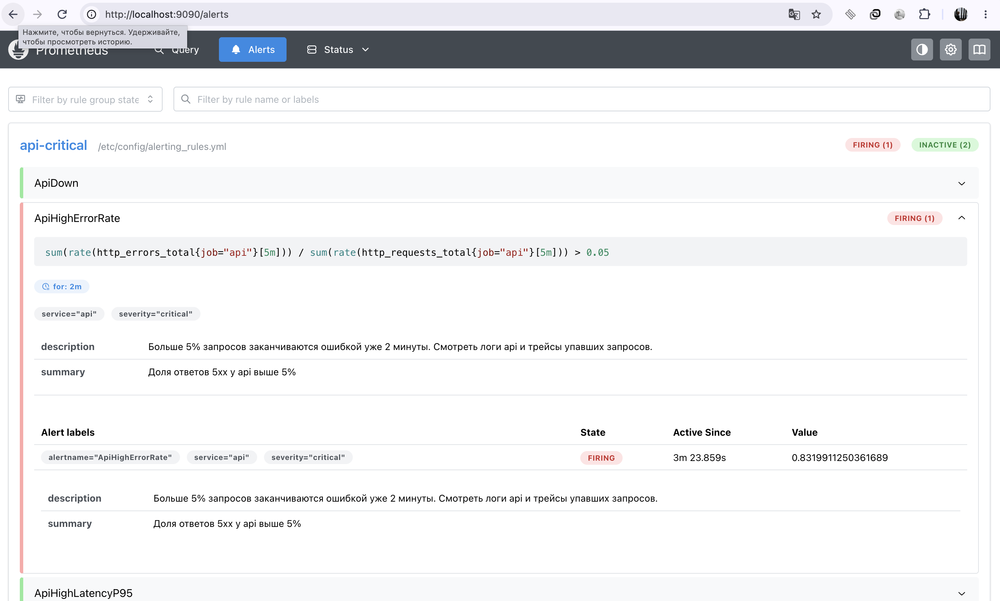
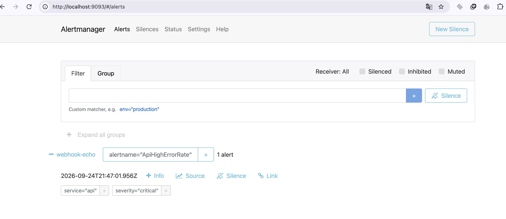
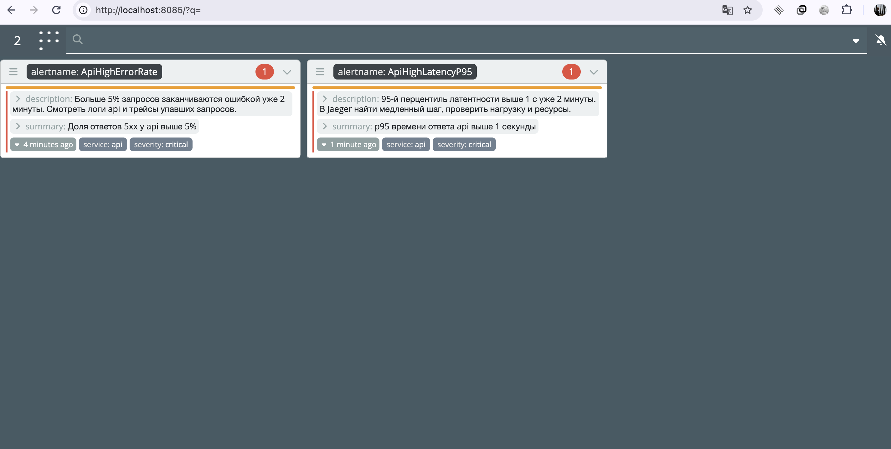

## Часть 4 — Алерты (Alertmanager + Karma)

Prometheus вычисляет правила алертов по метрикам `api`, а сработавшие алерты передаёт в Alertmanager. Alertmanager группирует их и отправляет получателю. Karma показывает все активные алерты в одной панели. Всё развёрнуто в k3s, в namespace `lab2-observability`, через Helm.

### Что настроено

- **Alertmanager.** Включён в values чарта Prometheus (`alertmanager.enabled: true`). Постоянное хранилище для него отключено (`alertmanager.persistence.enabled: false`): в кластере нет автоматической выдачи дисков, и заявка на диск вечно висела в `Pending`. Проверка связи: `curl localhost:9090/api/v1/alertmanagers` показывает Alertmanager в `activeAlertmanagers`.
- **Получатель (receiver).** Маленький сервис `webhook-echo`, который печатает в лог каждый полученный запрос. Alertmanager шлёт ему уведомления на `http://webhook-echo.lab2-observability.svc.cluster.local:8080/` (`send_resolved: true`). Алерты группируются по `alertname`, `group_wait: 10s`, `group_interval: 1m`, `repeat_interval: 1h`. Работу связки проверили вручную: отправили тестовый алерт `TestAlert` прямо в API Alertmanager, и через 10 секунд он пришёл в лог приёмника.
- **Правила алертов.** Лежат в `serverFiles.alerting_rules.yml` в `prometheus-values.yaml`, группа `api-critical`. Во всех выражениях указан `job="api"`, потому что метрики `api` собираются двумя способами (статический таргет `api` и автообнаружение по аннотациям) и без фильтра считались бы дважды.
- **Karma.** Чарт `zekker6/karma`, единственная настройка: `ALERTMANAGER_URI` с адресом сервиса Alertmanager (`k8s/karma-values.yaml`).

### Три критичных алерта

| Алерт | Условие | `for` | Что ловит | Почему важно | Что делает дежурный |
|---|---|---|---|---|---|
| **ApiDown** | `up{job="api"} == 0` | 1 мин | сервис не отвечает Prometheus | пользователи не могут пользоваться сервисом совсем | проверить под `api` и его логи, при необходимости перезапустить |
| **ApiHighErrorRate** | доля ответов 5xx среди всех запросов > 5% за 5 мин | 2 мин | сервис отвечает, но с ошибками | пользователи получают ошибки, даже если сервис «жив» | посмотреть логи `api` и трейсы упавших запросов, найти причину |
| **ApiHighLatencyP95** | p95 времени ответа > 1 с | 2 мин | сервис тормозит | пользователи ждут слишком долго, дальше начинаются таймауты | в Jaeger найти медленный шаг, проверить нагрузку и ресурсы |

Пояснения к выбору условий:
- Для ошибок берём **долю**, а не число: 10 ошибок из 10 запросов и 10 из 100 000 это разные ситуации, и число без нагрузки ничего не говорит.
- Условие `for` защищает от ложных тревог из-за короткого всплеска.
- Для ApiDown берём именно `job="api"` (статический таргет). Если под пропадёт целиком, таргет автообнаружения исчезнет вместе с ним и `up` для него не появится, а статический таргет остаётся, и его `up` становится 0.
- p95 считается по всем запросам сразу. Чтобы он превысил порог, запросов на `/slow` должно быть больше 5% от общего числа.
- Если запросов совсем нет, доля ошибок даёт «не число» (деление на ноль), и алерт не срабатывает. Отсутствие трафика ловит отдельная проблема, а не это правило.

### Проверка срабатывания

Сначала алерт находится в состоянии `Pending`, потом переходит в `Firing`. В Prometheus видно, сколько он уже активен и текущее значение выражения (на рисунке `ApiHighErrorRate` активен 3 мин 23 с, доля ошибок 0,83, то есть 83%):

После этого Prometheus передаёт алерт в Alertmanager, где он попадает в группу получателя `webhook-echo` с метками `service="api"`, `severity="critical"`:

Karma показывает все активные алерты в одном месте, здесь сработавшие `ApiHighErrorRate` и `ApiHighLatencyP95` вместе с описанием и метками:

