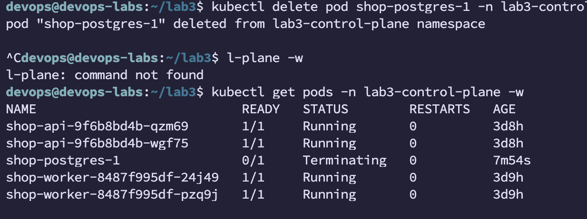

## Ограждения на кластер 

Выбрал Gatekeeper в основном потому что у нас в комании уже используется kyverno и интересно потрогать альтернативу. В целом gatekeeper дает большую гибкость в валидационных и мутационных правилах за счет использования в них полноценного языка, однако в свою очередь не имеет возможности генерировать и удалять ресурсы, kyverno же не супер стабильно работает на крупных инсталляциях, хотя последние версии улучшают данный момент. 

Описания политик: 
1. mem-limit -- требует одинаковых значений в requests и limits для памяти, такое предотвращает overcommit на ноде и возможные OOM
2. latest-tag -- запрещает тэг latest для образов, базовая защита от непреднамеренных обновлений
3. namespace -- требует лейбла app на неймспейсе, помогает при разметке и аттрибуции ресурсов в кластере
4. priviledged -- запрещает priviledged контейнеры, уменьшает возможости получить привелигированные права на ноде
5. requests -- требует установки requests, предотвращает overcommit ресурсов

При применении получили запрет -- part-1-1.png

## Postgres через оператора

Оператор — **CloudNativePG**, поставлен один раз на весь кластер (namespace `cnpg-system`). В чарт `shop` добавлены `templates/postgres-credentials.yaml` (Secret с логином/паролем) и `templates/postgres-cluster.yaml` (объект `Cluster`: 1 инстанс, диск 300Mi, `bootstrap.initdb` создаёт базу `shop`).

**Самоисцеление:** `kubectl delete pod shop-postgres-1 -n lab3-control-plane` → под вернулся сам, с тем же именем и тем же диском (в отличие от `api`, где под взаимозаменяем, у базы конкретные данные на конкретном PVC).

**spec/status** (`kubectl get cluster shop-postgres -n lab3-control-plane -o yaml`): `spec` — то, что написано руками в `postgres-cluster.yaml`. `status` целиком заполняет оператор: `readyInstances`, `currentPrimary: shop-postgres-1`, версия образа, health-проверки — ничего из этого я не писал, это результат его reconciliation loop.

**Отличие оператора и  `controller-manager`:** оба непрерывно сверяют actual и desired state через API server — механизм тот же. В основном отличие в нюансах настроек и конкретизации под сущность: `controller-manager` универсален (для него `Deployment` — это просто N одинаковых подов), а CloudNativePG понимает предметную область Postgres — знает про primary/replica, сам поставил `Termination Grace Period: 1800s` вместо стандартных 30 секунд, чтобы база не оборвалась на середине checkpoint, из-за этого под был довольно долго в состоянии Terminating.

